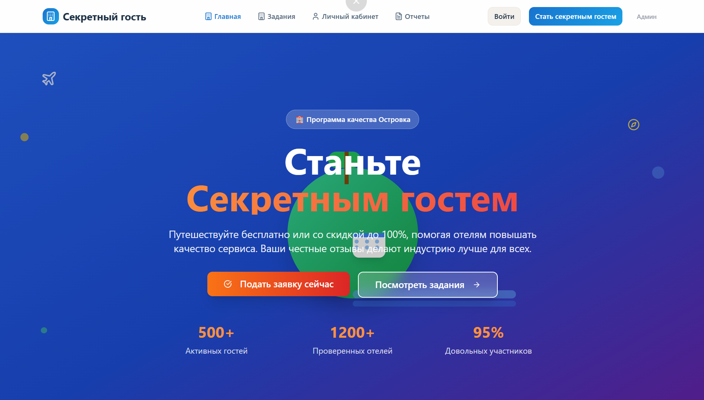
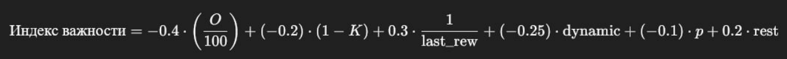

# О проекте

   

---
**SecretGuest** - это цифровой инструмент для платформы бронирования отелей Островок, позволяющий путешественникам анонимно проверять качество отелей и предоставлять объективные отчёты. Участники программы получают скидки или бесплатное проживание в обмен на подробные оценки сервиса, удобства и соответствия описаниям. Решение предоставлено для Хакатона от компании Островок.

## Ключевые компоненты:

- **Личный кабинет "Секретного гостя"**: рейтинг, текущие задания, история отчетов, достижения, настройки профиля и прочая статистика.
- **Система подбора отелей**: алгоритм распределения отелей между гостями, учитывающий данные отеля: геолокацию, срочность проверки, кол-во ранее оставленных отзывов - и выгоду для пользователя: скидки на проживание, промокоды на следующие поездки.
- **Составление отчетов**: функционал анкеты для заполнения, модерация отчетов.
- **Обновление карточки отеля**: отображение актуальной информации после проверки секретного гостя на карточке отеля.
- **Админ-панель**: валидация отчетов, просмотр статистики обо всех участниках программы, возможность создавать задание и добавлять отель в программу "секретного гостя", просматривать отчеты, отели и профили пользователей. Возможность одобрять или отклонять заявки. 
- **Игра-мотивация**: Игровой отчет о прохождении задания и увеличение уровня гостя на платформе, а так же таблица лидеров для того, чтобы соревноваться с другими участнивами.

## Уникальная функция:
  Для того, чтобы пользовались и учавствовали в программе "Секретный гость" нашей командой была разработана идея создать мини-игру внутри платформы.
  - Когда пользователь проходит задания на платформе: оставляет отзывы о разных процессах пребывания в отеле он получает очки, которые он в последующем может обменять на скидки в других отеляю Нами разработаны уровни пользователей в зависимости от их количества очков: Новичок --> "Эксперт --> Мастер --> Гуру --> Легенда. Пользователи могут видеть свои результаты в таблице лидеров и соревноваться со знакомыми и друзьями.

## Для кого проект?
- **Островок**: улучшение системы оценки отелей, точности предоставляемой информации о них и повышения доверия пользователей к компании
- **Путешественник**: получение скидок на путешествия взамен на составление детального отзыва об отеле, участие в уникальной программе "Секретный гость" и соревнование с другими участниками за получение новых достижений и призов для самых активных пользователей.
- **Владелец отеля**: предоставление скидок на проживание секретным гостям для получение честных, актуальных оценок, привлечения большего числа клиентов и повышения качества обслуживания.

## Архитектурные особенности:
- **Frontend**: React + TypeScript, модульная структура, переиспользуемые UI-компоненты, кастомные хуки, современный роутинг
- **Backend**: Node.js (Express), SQLite, модульная структура
- **UI**: TailwindCSS, кастомные компоненты, поддержка мобильной версии, темизации, отзывчивый дизайн, настройка на несколько языков.

# Возможности backend
- Быстрая запись данных в единую и расширяемую БД 
- Интеграция с фронтендом для визуализации и управления
- Лёгкий запуск, устойчивость, адаптивность
Backend легко расширяется и интегрируется с основнй платформой островка. Использование Node.js и современной базы данных обеспечивает надёжность, скорость и удобство поддержки.

# Подробный анализ платформы

- Разработан вся MPV версия продукта от регистрации до выполения целевого действия пользователем.
- Большая база данных с выборов отелей
В качестве базы данных была использована база данных sqllite т.к. она идеально подходит под наши условия mvp проекта.
- Возможность оценки качества обслуживания с загрузкой фотографий и отправление ее на админ-панель.
Огромная система оставки отзыва на все виды услуг начиная с работы персонала и заканчивая спа-зонами.
- Профиль пользователя  со статистикой, выполенными заданиями, количеством очков, местом в таблице, историей очков, историей отчетов, достижениями и возможностью поменять свои данные.
- Приветствующий лендинг с преимуществами и всей  подробной информацией про программу "Секретный гость".
Представлены все преимущества и мотиваирующие лозунги для нового пользователя.
- Огромный выбор заданий из обновляемой базы данныхы
- Админ-панель содержит такие показатели:
1. Средний рейтинг(он расчитывается по формуле исходя их всех оценок пользователей)
2. Подсчитаны все активные задания пользователей
3. Подсчитано количество отелей в программе
4. Подсчитано количество гостей принимающих участие в программе
5. Есть отдельное окно с проверкой на просроченные отчеты для того чтобы во время отвечать всем гостям и оперативно с ними связываться.
6. Представлена вся активность и статистика за неделю(новые заявки, завершенные заявки, новые отели и средний рейтинг отчетов)
7. С помощью поиска можно быстро найти оставленные заявки определенным пользователем

# Наш вариант формулы для алгоритма распределения отелей.

   

# Пояснения к коэффециентам

- -0.4 * (0/100) - коэффециент для O (количество отзывов), где чем больше отзывовm, тем меньше важность.
- 0.2 * (1 -K) - коэффециент для K (флаг признанности отеля), который отрицательно влияет на важность. 
- 0.3 * 1 / laas-rew -  коэффециент для laas-rew (давность последнего отзыва), где чем больше время с последнего отзыва, тем важнее отель для проверки.
- 0.25 * dynamic - коэффециент для dynamic(динамика оценок), где отрицательная динамика увеличивает важность.
- -0.1 * p - коэффециент для p (процент посещений секретных гостей), где большее значение уменьшает важность.
- 0.2 * rest - коэффециент для rest (флаг близости начала сезона),  котоырй положительно влияет на важность.

# Скринкаст с решением
https://disk.yandex.ru/i/WgcAJeUqIjhV_Q
#

Своим решение мы создали полноценный mvp продукт в котором пользователь может сделать целевое действие(весь цикл участия в программе "секретный гость"), а в свою очередь администратор может просматривать всю статистике буквально на 1 странице и сразу выявлять те или иные проблемы. 
